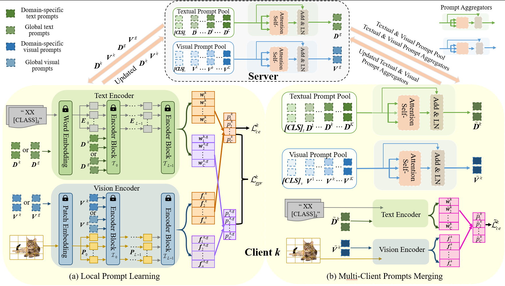

# PLAM: Federated Domain Generalization via Prompt Learning and Merging  
The official code for the paper ***Federated Domain Generalization via Prompt Learning and Merging***.




**Abstract:** Federated learning (FL) is a distributed machine learning paradigm that learns a global model from data distributed across multiple clients. 
Traditional FL approaches primarily concentrate on addressing data heterogeneity across clients but often overlook model generalization to clients with unknown distributions. Federated domain generalization (FedDG) aims to improve the global model’s generalization in unseen domains by addressing data heterogeneity inherent in FL.  A common idea of existing FedDG studies is to share domain-specific knowledge such as amplitude spectrum or class prototypes among clients. However, such information is extracted directly from local data, potentially posing a risk of data leakage.
In this paper, we integrate the prompt tuning based on pre-trained vision-language models (VLMs) into FedDG, and consider that the prompts tuned with local data could act as a more secure bridge to transfer knowledge among clients. Specifically, we propose a novel FedDG framework through Prompt Learning And Merging (PLAM), which employs a two-stage training strategy to collaboratively generate local prompts and global prompts at each round.
In the first stage, each client engages in both text and visual prompt learning using their own data, and the local prompts are indirectly aligned by regarding the global prompts as a common reference. In the second stage, each client exchanges their domain-specific local prompts and learns a lightweight aggregator to merge all local prompts. The server then averages the aggregator parameters from diverse clients and generates the shared global prompts, which will be used to guide VLMs to adapt to unseen domains. Given that our PLAM framework requires training only a limited number of prompts and the lightweight aggregators, it also offers advantages in computational and communication efficiency for FedDG.
Extensive experiments demonstrate the superior generalization ability of PLAM across four benchmark datasets..

## Requirement

The required packages are listed in `requirements.txt` for minimum requirement (Python 3.8.5):

```
$ pip install ftfy regex tqdm
$ pip install git+https://github.com/openai/CLIP.git
$ pip install -r requirements.txt
$ pip install torch==1.10.1+cu111 torchvision==0.11.2+cu111 torchaudio==0.10.1 -f https://download.pytorch.org/whl/cu111/torch_stable.html
```

## Datasets

[
PACS](https://wjdcloud.blob.core.windows.net/dataset/PACS.zip).

[VLCS](https://wjdcloud.blob.core.windows.net/dataset/VLCS/VLCS.zip).

[Office-Home](https://wjdcloud.blob.core.windows.net/dataset/OfficeHome.zip)

[DomainNet](https://ai.bu.edu/M3SDA/)  (Please download the **cleaned** version of split files  for DomainNet dataset.)

## Results on Office-Home

| Methods         | Art       | Clipart   | Product   | Real      | Average   |
| --------------- | --------- | --------- | --------- | --------- | --------- |
| FedCLIP         | 78.45     | 64.77     | 87.68     | 87.84     | 79.69     |
| PromptFL        | 82.98     | 68.98     | 92.14     | 90.27     | 83.59     |
| FedMaPLe        | 84.84     | 73.10     | 92.66     | 91.35     | 85.49     |
| **PLAM (Ours)** | **86.65** | **74.73** | **93.47** | **92.06** | **86.73** |


## How to run

We provide the commands for four tasks in Office-Home to reproduce the results.

```
 python methods/PLAM.py --dataset office-home --mode FedAtImg --test_envs 0 --iters 6   --wk_iters 1 --num_shots 0  --root_dir DATA_PATH --text_embedding_path TEXT_EMB_PATH --batch 32 --N_CTX 8 --lr2 0.0015 --c 0.9
```


## Acknowledgements

[FedCLIP](https://github.com/microsoft/PersonalizedFL.)

[MaPLe](https://github.com/muzairkhattak/multimodal-prompt-learning)
